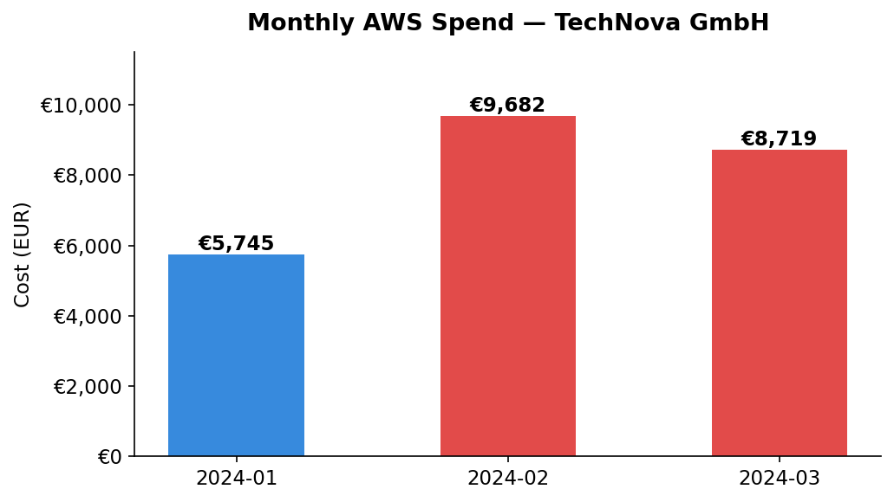
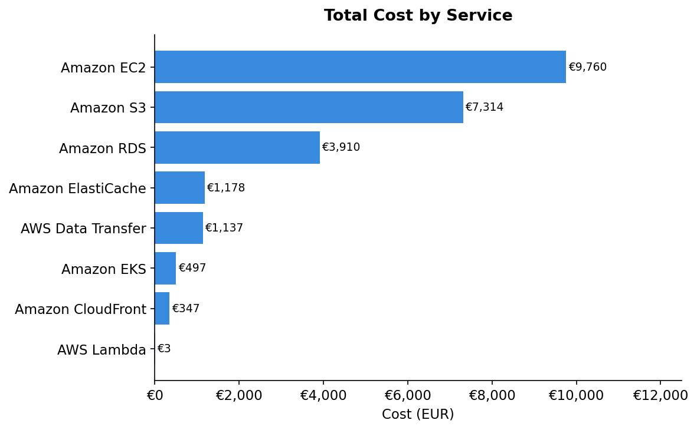
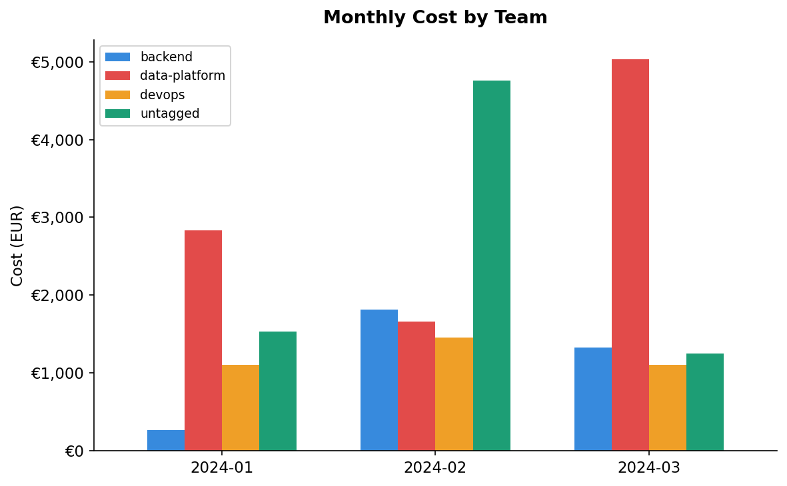
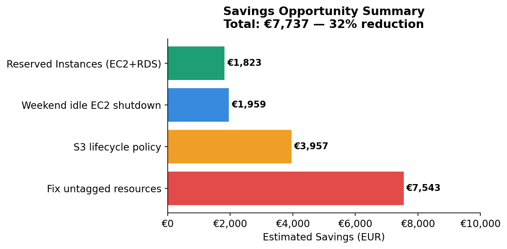

# ☁️ TechNova GmbH — AWS FinOps Analysis

[](https://nbviewer.org/github/ayhambokli/TechNova-GmbH-AWS-FinOps-Dashboard/blob/main/Finops_Data_Analysis.ipynb)
[](https://YOUR-APP-URL.streamlit.app)


> **Simulated Cortex Reply FinOps Engagement** | Python · Pandas · Matplotlib · Streamlit

A real-world FinOps data analysis project simulating a consultant engagement at **Cortex Reply**.
The client (TechNova GmbH) saw their AWS bill jump **69% in a single month** with no explanation.
This project identifies the root causes and quantifies **€7,737 in savings opportunities (32% reduction)**.

---

## 📋 Project Overview

| | |
|---|---|
| **Client** | TechNova GmbH (simulated) |
| **Analyst** | Cortex Reply FinOps Team |
| **Period** | January – March 2024 |
| **Cloud** | AWS (eu-central-1) |
| **Tools** | Python, Pandas, Matplotlib, Streamlit |

### The Problem

> *"Our AWS bill jumped from €42,000/month to €71,000/month over the last 3 months and nobody on our side can explain why."*
> — Marcus Weber, CTO TechNova GmbH

---

## 📊 Key Findings

### 1. Monthly Cost Trend — 69% spike in February


### 2. Cost by Service — EC2 and S3 drive 70% of spend


### 3. Cost by Team — 31% untagged with no owner


### 4. Savings Opportunities — €7,737 identified


---

## 💡 Savings Summary

| # | Finding | Saving | Action |
|---|---------|--------|--------|
| 1 | 31% of spend untagged — no owner | €7,542 | Enforce tagging via AWS Config Rules |
| 2 | S3 raw-logs bucket growing 77% | €3,956 | Add S3 lifecycle policy |
| 3 | 4 EC2 instances idle on weekends | €1,958/yr | AWS Instance Scheduler |
| 4 | 100% On-Demand, zero Reserved Instances | €1,822 | Purchase 1-year RIs |
| | **Total** | **€7,737** | **32% cost reduction** |

---

## 🗂️ Project Structure

```
finops-project/
│
├── aws_billing.csv              # AWS Cost & Usage data (126 rows)
├── ec2_usage_metrics.csv        # EC2 CPU & memory utilization (54 rows)
├── resource_inventory.csv       # Resource metadata — owner, team, cost center (42 rows)
│
├── Finops_Data_Analysis.ipynb   # Full analysis notebook
├── dashboard.py                 # Streamlit dashboard
├── README.md
│
└── charts/
    ├── chart1_monthly_cost.png
    ├── chart2_cost_by_service.png
    ├── chart3_cost_by_team.png
    └── chart4_savings.png
```

---

## 🚀 How to Run

### 1. Clone the repo
```bash
git clone https://github.com/ayhambokli/TechNova-GmbH-AWS-FinOps-Dashboard.git
cd TechNova-GmbH-AWS-FinOps-Dashboard
```

### 2. Install dependencies
```bash
pip install pandas numpy matplotlib streamlit
```

### 3. Run the Jupyter notebook
```bash
jupyter notebook Finops_Data_Analysis.ipynb
```

### 4. Launch the Streamlit dashboard
```bash
streamlit run dashboard.py
```

---

## 🔍 Analysis Steps

| Step | Description |
|------|-------------|
| 1. Explore | Understand structure, dtypes, and missing values across all 3 datasets |
| 2. Clean | Fix date types, normalize environment values, fill missing tags, convert USD → EUR |
| 3. Merge | LEFT JOIN billing ← inventory ← usage metrics into one enriched dataframe |
| 4. Analyse | 9 analyses covering cost trends, team allocation, idle resources, RI gap, S3 growth |
| 5. Visualize | Matplotlib charts — one per analysis |
| 6. Dashboard | Streamlit app with 5 tabs — Overview, Teams, EC2, S3, Savings |
| 7. Report | Findings, conclusions, and FinOps recommendations |

---

## 💡 FinOps Concepts Covered

- **FinOps Lifecycle** — Inform → Optimize → Operate
- **Showback & Chargeback** — cost allocation by team and cost center
- **Tagging strategy** — identifying and fixing untagged resource spend
- **Rightsizing** — detecting idle and overprovisioned EC2 instances
- **Reserved Instances** — quantifying savings from commitment-based pricing
- **S3 Lifecycle Policies** — identifying uncontrolled storage growth
- **Cost allocation** — splitting shared cloud costs across engineering teams

---

*Built as part of interview preparation for a FinOps Data Analyst & Consultant role at Cortex Reply.*
